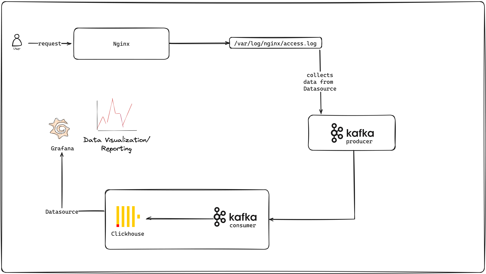

# Scalehouse: Real-time Website Traffic Analysis with ClickHouse

This project aims to build a real-time analysis of website traffic using ClickHouse. The system will ingest website visit data in real-time, store it efficiently, and provide interactive visualization of key metrics to derive insights into user behavior.

## Components



### Data Source
- [x] Set up a web server log collection mechanism (Nginx `access.log` module) to capture website visit data.

### Data Processing Pipeline
- [x] Utilize a stream processing framework like Apache Kafka or Apache Flink to receive and process log data continuously.
- [x] Extract relevant fields from logs (`timestamp`, `request method`, `URL`, `HTTP status code`, `user agent`...).
- [ ] Clean and transform data, including filtering out bots and optionally enriching with additional context.

### ClickHouse Integration
- [x] Define a ClickHouse table optimized for efficient storage of website traffic data (`DateTime` for timestamps, `UInt32` for counts, `String` for URLs).
- [ ] Implement a partitioning strategy (e.g., by date or hour) to enhance query performance.
- [ ] Configure ClickHouse for data compression (e.g., LZ4) and appropriate merge tree settings (`SummingMergeTree`) for managing large volumes of real-time data.

### Data Visualization
- [x] Visualization platform (Grafana or ClickHouse web interface) to interact with ClickHouse via SQL queries.
- [ ] Create dashboards displaying key metrics such as total visits, unique visitors, popular pages, average time on site, traffic sources, and error rates.
- [ ] Use time-series visualizations (e.g., line charts, heatmaps) to analyze traffic patterns over time.


## Benefits

- **Real-time Insights:** Immediate understanding of website traffic patterns for quick decision-making.
- **Scalability:** ClickHouse efficiently handles large datasets, supporting real-time analysis of high-volume traffic.

## Additional Considerations

- [ ] **Security:** Implement user authentication and access control in ClickHouse to safeguard sensitive data.
- [ ] **Privacy:** Adhere to privacy regulations by anonymizing user data or obtaining necessary consent.
- [ ] **Monitoring:** Set up alerts for significant traffic changes or processing errors.


This project provides a powerful platform to gain actionable insights from real-time website traffic data using ClickHouse. By integrating efficient data processing and visualization components, it enables data-driven decisions for improving website performance and user experience.

## How to run the application locally?

```bash
# install all dependencies
npm install
```

- Run all required services using `docker compose`
```bash
docker compose up -d
```

To run kafka producer and consumer, open seperate terminals
```bash
npm run start:producer
# and
npm run start:consumer
```
